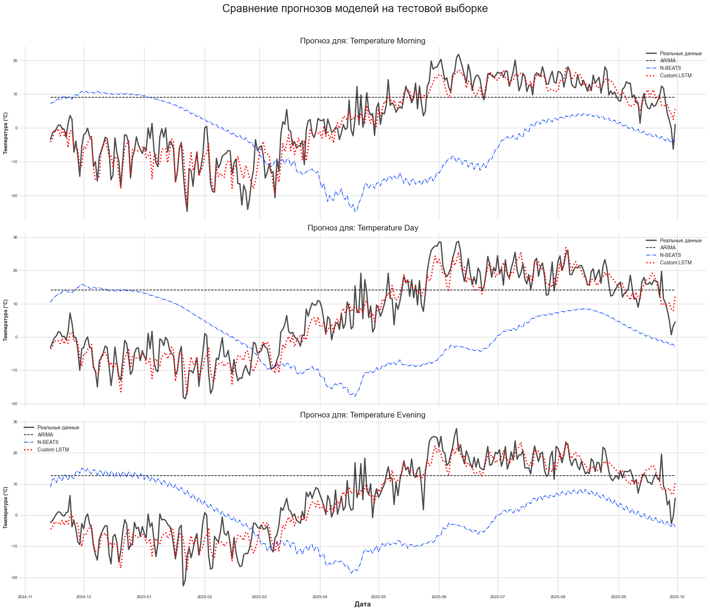

# WeatherForecast: End-to-End Проект по Прогнозированию Временных Рядов

Этот репозиторий содержит полный **End-to-End (E2E)** пайплайн для сбора, хранения, анализа и прогнозирования погодных данных. Проект демонстрирует создание production-ready решения с нуля: от разработки отказоустойчивого веб-скрапера до обучения и сравнения нескольких моделей машинного обучения для решения задачи многомерного прогнозирования временных рядов.

## 🚀 Ключевые достижения и особенности

*   **Промышленный веб-скрапер:** Разработан кастомный, **параллельный** скрапер (`requests` + `ThreadPoolExecutor`), способный эффективно собирать большие архивы данных. Его архитектура включает:
    *   **Проактивную генерацию URL**, исключающую зависимость от навигации сайта.
    *   **Механизм повторных попыток (`retries`)** с экспоненциальной задержкой (`exponential backoff`) для автоматической обработки сетевых ошибок и временных блокировок.
    *   **Надежный парсинг данных** напрямую из встроенных JS-объектов, что делает его неуязвимым к изменениям HTML-верстки.

*   **Продвинутый Feature Engineering:** Реализованы современные техники подготовки данных для временных рядов:
    *   **Обработка циклических признаков** (день года, месяц, направление ветра) путем их преобразования в синус/косинус для корректной интерпретации моделями.
    *   **Создание лаговых признаков** на основе анализа автокорреляционных функций (ACF/PACF).

*   **Турнир моделей:** Для решения задачи многомерного прогнозирования (температура утром, днем и вечером) были обучены и сравнены три модели разной философии:
    1.  **Baseline (ARIMA):** Классический статистический подход.
    2.  **SOTA "из коробки" (N-BEATS):** Современная Deep Learning архитектура из библиотеки Darts.
    3.  **Собственное решение (Custom LSTM):** Рекуррентная нейронная сеть, написанная с нуля на PyTorch, использующая полный набор созданных признаков.

*   **Профессиональный цикл обучения:** Для кастомной LSTM реализован production-ready цикл обучения с использованием `Learning Rate Scheduler` и `Early Stopping` для достижения оптимального результата и предотвращения переобучения.

## 🏆 Результаты

**Визуальное сравнение показывает безоговорочное преимущество кастомной LSTM-модели.** В отличие от ARIMA (которая не уловила сезонность) и N-BEATS (которая уловила только сезонность, но не локальные колебания), кастомная LSTM смогла точно повторить как глобальные сезонные паттерны, так и ежедневные резкие изменения температуры.



**Метрики подтверждают визуальный анализ:**

| Метрика | Модель | `temp_morning` | `temp_day` | `temp_evening` |
| :--- | :--- | :--- | :--- | :--- |
| **MAE (°C)** | ARIMA | ~10.04 | ~11.31 | ~10.72 |
| | N-BEATS | ~15.52 | ~16.13 | ~15.63 |
| | **Custom LSTM** | **~2.89** | **~2.94** | **~3.25** |

**Вывод:** Кастомная LSTM, обученная на богатом наборе инженерных признаков, показала **в 3-5 раз меньшую ошибку**, чем стандартные и SOTA-модели "из коробки", что доказывает эффективность глубокого анализа данных и кастомного подхода.

## 🛠️ Технологический стек

| Область | Технологии |
| :--- | :--- |
| **Сбор данных** | `Python`, `requests`, `BeautifulSoup4`, `concurrent.futures` |
| **Хранение данных** | `SQLite`, `SQLAlchemy` |
| **Анализ и Feature Engineering** | `Pandas`, `NumPy`, `Matplotlib`, `Seaborn`, `statsmodels` |
| **Машинное обучение** | `PyTorch`, `Darts`, `Scikit-learn` |
| **Структура проекта** | Модульный код (`src/`), Jupyter Notebooks для исследований |

## 📁 Структура проекта

```
weather_vault/
│
├── .gitignore
├── README.md
├── requirements.txt
│
├── data/                  # (пусто в репозитории, для локальной weather.db)
│
├── notebooks/
│   ├── 1_data_exploration.ipynb
│   └── 2_model_training.ipynb
│
└── src/
    ├── README.md          # Техническая документация по модулям
    ├── __init__.py
    ├── config.py
    ├── database.py
    ├── scraper.py
    └── run_scraper.py
```

## ⚙️ Установка и запуск

### 1. Клонирование и настройка окружения

```bash
git clone https://github.com/your_username/weather_vault.git
cd weather_vault
python -m venv venv
# Активация: venv\Scripts\activate (Windows) или source venv/bin/activate (macOS/Linux)```
```
### 2. Установка зависимостей
*Для корректной установки PyTorch с поддержкой GPU рекомендуется использовать команду с официального сайта PyTorch, соответствующую вашей конфигурации CUDA.*

```bash
pip install -r requirements.txt
```

### 3. Запуск скрапера для сбора данных
Этот шаг необходимо выполнить первым. Скрипт соберет многолетний архив погоды (~5000 дней) и сохранит его в `data/weather.db`.

**Внимание:** Процесс займет продолжительное время (20-40 минут).

```bash
python -m src.run_scraper
```

### 4. Проведение анализа и обучения
После успешного сбора данных можно запускать Jupyter Notebooks.

```bash
jupyter notebook
```
В открывшемся окне браузера перейдите в `notebooks/` и последовательно выполните `1_data_exploration.ipynb` и `2_model_training.ipynb`.

## ⚖️ Правовые и этические аспекты

Данный проект является исключительно учебным и некоммерческим.

*   **Пользовательское соглашение:** Сбор данных произведен в рамках **"личного некоммерческого использования"**, разрешенного пользовательским соглашением сайта-источника.
*   **Приватность данных:** Собранные данные (`data/weather.db`) **не распространяются** в данном репозитории (директория `data/` включена в `.gitignore`).
*   **"Вежливый" скрапинг:** Скрапер использует консервативные настройки по количеству потоков и задержкам для минимизации нагрузки на сервер-источник.

---
### Лицензия
Код данного проекта распространяется под лицензией MIT.